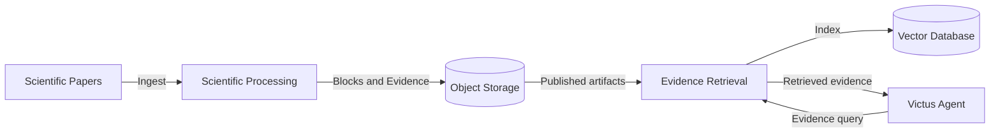
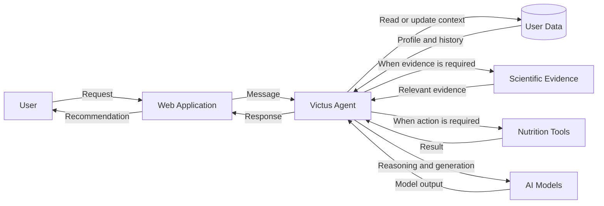

# Data Flow

Victus has two primary data flows:

1. scientific evidence preparation;
2. personalized user interaction.

These flows connect the scientific pipeline with the user-facing product while keeping their responsibilities independent.

## Scientific Evidence Flow

Scientific papers are processed before they become available to the agent.

The flow is:

1. scientific papers enter `victus-processing`;
2. papers are transformed into structured artifacts;
3. validated artifacts are published to object storage;
4. `victus-rag` indexes the published evidence;
5. the Agent queries the retrieval system when scientific support is required.

This separation allows scientific evidence to be processed and versioned independently from user requests.

## User Interaction Flow

The Agent coordinates personalization, evidence, tools, and response generation.

Not every request requires every dependency.

Depending on the user's intent, Victus may:

* answer using existing context;
* retrieve scientific evidence;
* record or update user information;
* execute a nutrition tool;
* request clarification or confirmation;
* apply additional safety handling.

The Agent is responsible for deciding which capabilities are required for each interaction.

## Data Ownership

The main data responsibilities are intentionally separated:

| Data                            | Owner                    |
| ------------------------------- | ------------------------ |
| User profile and events         | Agent / application data |
| Original scientific papers      | Scientific Processing    |
| Structured scientific artifacts | Scientific Processing    |
| Search indexes                  | Evidence Retrieval       |
| Versioned scientific datasets   | Object Storage           |

This separation keeps user data, scientific source data, and retrieval indexes independent from each other.

## Implementation Status

The complete flow shown above represents the architectural integration of Victus.

Some connections are still under development, particularly the integration between the Agent, scientific retrieval, profile tooling, and nutrition planning.

See [Current Status](../overview/current-status) for the authoritative implementation state.
