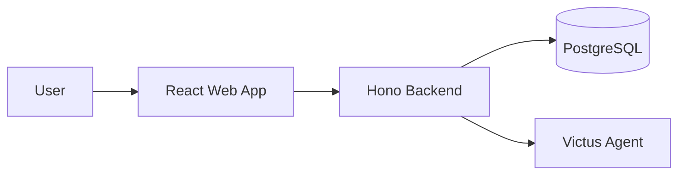
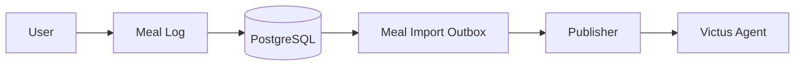
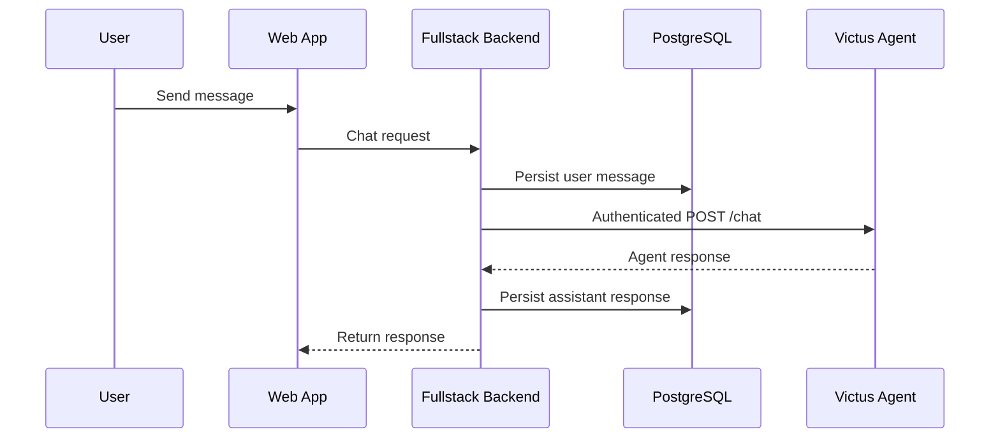

# Fullstack

Victus Fullstack is the user-facing web product of Victus.

It provides the browser application, authenticated product backend, persistent product state, meal logging experience, user profile views, biometrics views, conversation history, and the HTTP gateway used to communicate with Victus Agent.

The Fullstack subsystem does not contain the Agent, Retrieval, Scientific Processing, Phoenix, or production infrastructure. It integrates with those systems through explicit boundaries.

## Responsibility

Victus Fullstack is responsible for:

- providing the web user experience;
- authenticating users and maintaining product sessions;
- storing product-owned user data;
- persisting conversations and chat history;
- exposing profile, biometrics, preferences, and meal logging interfaces;
- maintaining the local food catalog used by the product;
- forwarding conversational requests to Victus Agent;
- preserving the mapping between product conversations and Agent conversations;
- handling product-level failures and unavailable dependencies;
- providing a stable backend boundary between the browser and external Victus systems.

Victus Fullstack does not own:

- conversational reasoning;
- Agent runtime state;
- scientific retrieval;
- scientific evidence processing;
- scientific answer generation;
- Agent event and projection persistence;
- production infrastructure outside its local development stack.

## Architecture

The subsystem is composed of three primary runtime elements:

- a React/Vite frontend;
- a TypeScript backend built with Hono;
- a PostgreSQL database.

The backend also acts as the product gateway to Victus Agent.



The browser does not communicate directly with the Agent or database.

The backend owns authentication, product data access, conversation persistence, and integration with external Victus services.

## Web Application

The frontend provides the main Victus product experience.

Its current application areas include:

- authentication;
- chat;
- conversation history;
- meal logging;
- food search;
- profile;
- biometrics;
- preferences;
- weekly meal views.

Some UI elements still represent demo or product-shell behavior and should not be interpreted as active backend capabilities.

In particular, static nutrition-focus content, evidence cards, landing-page nutrition values, and chat trace displays are not currently backed by real Retrieval or Agent evidence data.

The web application should remain focused on presentation and user interaction rather than owning business or integration logic.

## Backend

The Hono backend is the application boundary between the browser, PostgreSQL, and external Victus services.

It is responsible for:

- authentication and session management;
- authorization and user isolation;
- CSRF protection;
- product data reads and writes;
- conversation persistence;
- meal and food-catalog operations;
- forwarding chat requests to Victus Agent;
- propagating identity and tracing information;
- returning normalized product responses to the frontend.

The backend should not reimplement Agent reasoning or scientific retrieval behavior.

External systems are accessed through explicit gateway boundaries.

## Authentication and Identity

Victus Fullstack is currently the source of truth for product users and sessions.

The product supports email and password authentication.

Passwords are stored using Argon2-derived hashes.

Authenticated sessions use browser cookies with short-lived access tokens and rotating refresh tokens. Revocable session state is persisted in PostgreSQL.

Unsafe browser requests are protected through CSRF controls.

Google authentication is partially integrated through Better Auth. UI and provider configuration exist, but the current migration/runtime path has not yet been fully validated.

After external provider authentication, Victus establishes its own product session rather than allowing the external identity provider to become the application session authority.

The Fullstack backend propagates the authenticated user identity to Victus Agent when making chat requests.

The model is never responsible for establishing user identity.

## Product Data

Victus Fullstack owns product-visible persistent state.

Conceptually:

```text
Fullstack PostgreSQL

Users
Sessions
Profile
Biometrics
Preferences
Conversations
Messages
Meals
Food Catalog
Integration Outbox
```

This database is independent from Victus Agent persistence.

The Fullstack and Agent systems exchange logical identifiers and authenticated requests rather than sharing a database.

## Profile, Biometrics, and Preferences

The backend stores and exposes user profile information, biometrics, and preferences.

The current product can read and display this information.

Backend write operations for biometrics and preferences exist, but the product UI does not yet provide complete onboarding and editing flows for all of them.

These values are product-owned state unless explicitly synchronized to another Victus subsystem through a defined contract.

The Fullstack database therefore remains authoritative for the product-facing representation currently implemented.

## Food Catalog and Meal Logging

The product includes a FoodB-based food catalog.

Users can search the catalog, inspect foods, and record consumed meals.

The food catalog is stored in PostgreSQL after being materialized from the repository data source.

At present, this materialization is an explicit operational step rather than part of a fully automated environment bootstrap.

Meal records are persisted by Fullstack.

A meal write also creates an entry in a transactional outbox intended for delivery to Victus Agent.



The Publisher → Agent path is part of the intended architecture but is not currently implemented.

The outbox therefore represents a pending integration boundary rather than an active end-to-end workflow.

Meals remain safely persisted in Fullstack even when delivery to the Agent has not occurred.

## Conversation Flow

Chat is the main active integration between Fullstack and Victus Agent.



The backend persists the user request before invoking the Agent.

This means conversation history remains product-owned even when the external Agent is temporarily unavailable.

The Fullstack stores conversations and messages for listing, recovery, and archival.

The Agent maintains its own orchestration state and conversation execution state independently.

The product and Agent therefore have related but different conversation responsibilities:

```text
Fullstack
→ conversation history visible to the user

Agent
→ execution state required to continue reasoning
```

These two representations must be connected through stable logical conversation identifiers.

## Agent Integration

The current active Agent integration is an authenticated HTTP request from the Fullstack backend to the external Victus Agent.

Conceptually:

```text
Fullstack Backend
        ↓
Authenticated Chat Contract
        ↓
Victus Agent
```

The backend forwards the authenticated user identity and propagates relevant tracing headers.

Victus Agent is not part of the Fullstack deployment and must be available independently.

If the Agent is unavailable or returns an error, the product surfaces that failure rather than generating a local fallback answer.

This preserves a clear boundary between product delivery and conversational reasoning.

## Scientific Systems

Victus Fullstack does not communicate directly with Scientific Processing.

It also does not currently communicate directly with Victus Retrieval.

The intended product flow is:

```text
User
 ↓
Fullstack
 ↓
Agent
 ↓
Retrieval
 ↓
Scientific Evidence
```

This keeps scientific retrieval and reasoning behind the Agent boundary rather than exposing them directly to the browser.

UI elements that visually represent evidence should only be treated as real evidence views once the Agent and Retrieval integrations provide the required data contract.

## Weekly Meal View

The current weekly plan experience is a view over logged meals.

It should not currently be described as a generated dietary plan or recommendation engine.

The product supports meal categories in its backend model, but current UI behavior does not yet expose the complete intended planning experience.

Future generated dietary planning should remain a separate product capability coordinated through Victus Agent rather than being inferred from the existing meal calendar.

## Persistence

PostgreSQL is the authoritative persistence layer for Fullstack-owned data.

It currently stores product identity, sessions, user-facing profile data, biometrics, preferences, conversations, messages, meals, food-catalog state, and integration outbox records.

Physical schema details belong to the repository implementation and database migration system.

The Wiki documents ownership and conceptual relationships rather than copying table definitions.

The current backend still performs schema initialization during application startup and contains transitional database behavior from the ongoing backend migration.

A production-ready version should use versioned migrations instead of runtime DDL as the long-term schema-management strategy.

## Observability

The backend includes optional tracing instrumentation.

Trace context can be propagated to external systems such as Victus Agent.

The current local development environment does not include Phoenix as part of the Fullstack Compose stack.

Observability should therefore be treated as an integration capability rather than a locally guaranteed service dependency.

The Fullstack should expose enough telemetry to diagnose:

- authentication failures;
- backend errors;
- Agent availability;
- chat latency;
- external integration failures;
- database errors;
- pending integration outbox state.

## Local Runtime

The current product runtime consists primarily of:

```text
React Frontend
      ↓
Hono Backend
      ↓
PostgreSQL
```

Victus Agent remains an external dependency.

The local environment does not currently provide a fully reproducible integrated Victus runtime containing Fullstack, Agent, Phoenix, and all required data materialization steps.

FoodB catalog materialization is also currently an explicit setup step.

The repository's local runtime should eventually make the minimum product dependencies reproducible without requiring undocumented manual preparation.

## External Dependencies

**Victus Agent**

Provides conversational reasoning and controlled capability execution.

**PostgreSQL**

Stores Fullstack-owned product state.

**FoodB Data**

Provides the source catalog used for local food search and meal logging.

**Google / Better Auth**

Provides optional external authentication for Google login.

**OpenTelemetry-compatible infrastructure**

Receives optional application tracing when configured.

Victus Retrieval and Scientific Processing are not direct dependencies of Fullstack.

## Current Scope

The current Fullstack already provides a substantial functional product foundation.

Implemented areas include:

- email/password authentication;
- revocable product sessions;
- conversation persistence;
- conversation recovery and archival;
- chat gateway integration;
- food search;
- meal CRUD;
- profile reads;
- biometrics reads;
- preferences reads;
- language settings;
- navigable product UI.

Partially implemented areas include:

- Google authentication runtime validation;
- biometrics and preference editing;
- complete onboarding;
- weekly meal planning UX;
- integrated Agent runtime availability;
- automated FoodB materialization;
- deployed observability.

Not currently implemented include:

- reliable meal delivery from the outbox to Victus Agent;
- direct Retrieval integration;
- direct Scientific Processing integration;
- wearables integrations;
- a complete production deployment environment;
- real evidence-backed UI cards;
- production-grade database migration management.

The product should therefore be considered a functional web application foundation with an active Agent chat boundary, but not yet a fully integrated Victus product environment.

## Design Principles

### Product state stays product-owned

User sessions, product-visible conversations, meal logs, and product-facing profile data remain responsibilities of Fullstack unless an explicit cross-system contract transfers or synchronizes them.

### Agent reasoning stays outside Fullstack

The backend forwards authenticated requests but does not reproduce Agent logic.

### Browser access goes through the backend

The frontend should not communicate directly with databases or internal Victus services.

### Explicit integration boundaries

External systems are accessed through stable gateways and contracts rather than shared persistence.

### Persist before external execution

Important user actions should be durably recorded before depending on external services whenever the workflow allows it.

### Independent system ownership

Fullstack and Agent may reference the same user or conversation, but each system owns different state and does not share its database.

### Honest capability representation

Demo content, static evidence displays, and incomplete integrations must not be documented as active product capabilities.

### Implementation truth remains in code

The Wiki explains Fullstack ownership, architecture, and system boundaries.

The `victus-fullstack` repository defines exact routes, schemas, frontend behavior, database migrations, Docker setup, local operations, and implementation details.