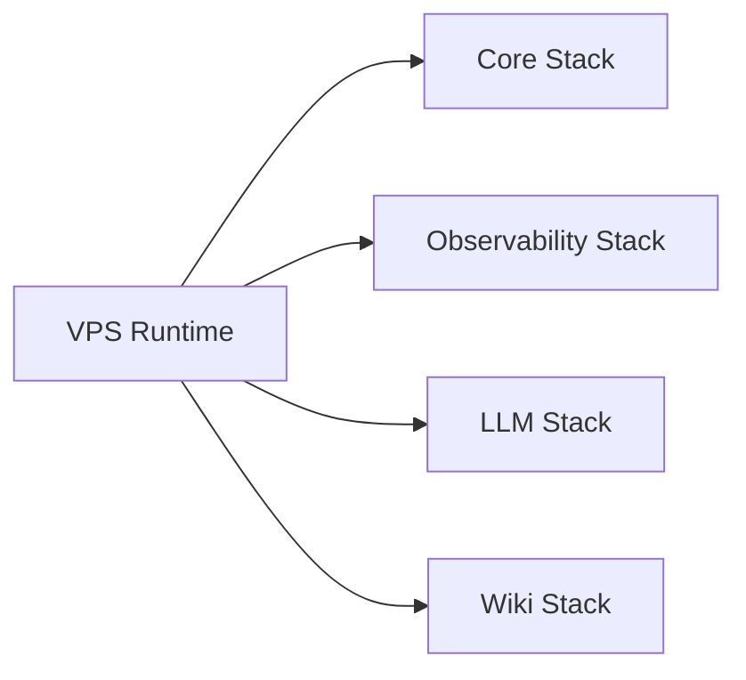
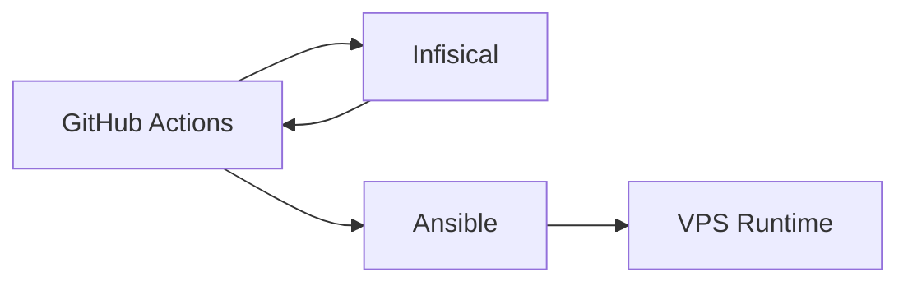
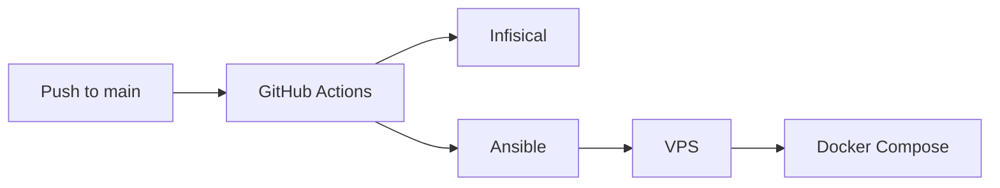
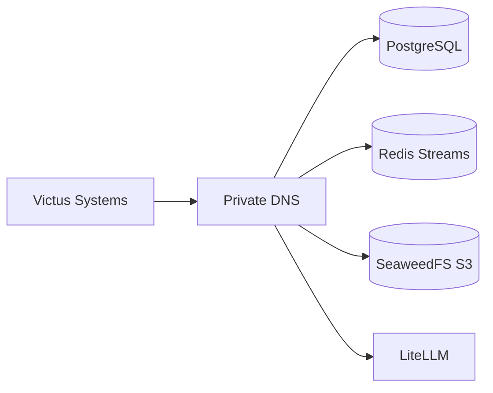

# Infrastructure

Victus Infrastructure provides the shared runtime environment used by the Victus ecosystem.

It defines the common services, networking, persistence, observability, secret management, and deployment automation required by other Victus systems.

The infrastructure repository does not contain application logic, scientific processing logic, retrieval behavior, or conversational reasoning. Its responsibility is to provide stable runtime capabilities that other systems can consume through explicit endpoints and contracts.

## Responsibility

Victus Infrastructure is responsible for:

- defining the shared Docker runtime;
- provisioning and deploying the production VPS;
- providing shared PostgreSQL, Redis, and S3-compatible storage;
- providing private DNS and service discovery;
- providing private and public HTTP routing;
- managing infrastructure secrets through external secret management;
- providing LLM gateway and LLM observability services;
- providing infrastructure metrics and log storage;
- hosting the central Wiki.js documentation runtime;
- validating infrastructure changes before deployment;
- exposing stable infrastructure endpoints to consumer systems.

Victus Infrastructure does not own:

- application business logic;
- scientific document processing;
- retrieval algorithms or vector indexes;
- Agent orchestration;
- user-facing product behavior;
- consumer-specific database schemas;
- domain-specific event semantics;
- application-specific workers;
- application deployment logic that does not belong to the shared runtime.

## Architecture

The production runtime is organized into four infrastructure stacks.



Each stack has a distinct responsibility and can be deployed independently while sharing selected runtime networks.

The current stacks are:

```text
core
observability
llm
wiki
```

Docker Compose is the source of truth for runtime topology.

Ansible prepares the host and deploys the Compose-defined runtime.

## Core Stack

The Core stack contains the infrastructure services intended to be shared by Victus systems.

Its main components are:

```text
SeaweedFS
PostgreSQL
Redis
etcd
CoreDNS
private NGINX
public NGINX
```

Conceptually:

```text
Victus Systems
     ↓
Private DNS / Edge
     ↓
Shared Runtime Services
     ↓
PostgreSQL / Redis / S3
```

The Core stack provides persistence, event transport, object storage, service discovery, and network routing.

## Data and Persistence

Victus Infrastructure provides several forms of persistent state.

### PostgreSQL

A shared PostgreSQL service is available for systems that require durable registry or coordination state.

Infrastructure owns the runtime service.

Consumer repositories own their application schemas and migrations.

This means:

```text
victus-infra
→ owns PostgreSQL availability

consumer repository
→ owns database schema and domain semantics
```

The infrastructure layer should not become the owner of application tables.

### Object Storage

SeaweedFS provides an S3-compatible storage interface.

It is intended for:

- source artifacts;
- scientific processing artifacts;
- retrieval datasets and exports;
- temporary shared objects;
- future backup artifacts.

Object storage is shared infrastructure, but the meaning and lifecycle of domain-specific artifacts remain owned by the producing system.

### Redis

Redis is configured with persistence and Redis Streams support.

Its primary role is operational event transport.

Redis should not be considered the final source of truth for durable application state.

Conceptually:

```text
PostgreSQL
→ durable state

Redis Streams
→ operational event delivery
```

Consumers are responsible for handling duplicate events, acknowledgements, retries, and recovery against their authoritative durable state.

### Host Persistence

Persistent service data is stored outside the lifecycle of individual containers.

This allows services to survive container restarts and redeployments.

Current persistence includes data for:

- PostgreSQL;
- SeaweedFS;
- Redis;
- etcd;
- Prometheus;
- Loki;
- LLM PostgreSQL;
- Wiki PostgreSQL.

This protects against container replacement but does not currently protect against complete VPS or disk loss.

## Networking

Victus networking separates private infrastructure traffic from explicitly public services.

### Private Network

Tailscale provides the primary private access layer for infrastructure services.

Services intended only for Victus systems or operators should remain accessible through the private network rather than being directly exposed to the public Internet.

### Private Service Discovery

CoreDNS provides private DNS for shared Victus infrastructure.

The private zone is:

```text
victus.io
```

Examples of infrastructure service names include:

```text
s3.victus.io
pipeline-postgres.victus.io
redis.victus.io
litellm.victus.io
langfuse.victus.io
```

Consumer systems should prefer stable infrastructure DNS names instead of depending on Docker container names or host paths.

### Private Edge

Private HTTP services such as LiteLLM, Langfuse, and S3 access can be routed through NGINX bound to the private network.

This provides a stable service boundary without exposing internal container ports directly.

### Public Edge

Public HTTP access is explicitly controlled.

The current primary public infrastructure service is Wiki.js.

```text
Internet
   ↓
Public NGINX
   ↓
Wiki.js
```

Public NGINX exposes HTTP/HTTPS and uses Let's Encrypt certificates.

Other infrastructure services should not become public by default.

## LLM Infrastructure

Victus Infrastructure provides a dedicated LLM runtime stack.

The main components are:

```text
LiteLLM
Langfuse
LLM PostgreSQL
```

### LiteLLM

LiteLLM provides a shared OpenAI-compatible model gateway.

Its role is to centralize model-provider access and related gateway behavior.

Consumer systems can use the gateway without needing to know deployment details of the LLM stack.

### Langfuse

Langfuse provides LLM-focused tracing, cost inspection, and audit visibility.

It is separate from infrastructure-level metrics and logging.

The LLM stack stores persistent application state in its own PostgreSQL runtime.

Provider credentials and runtime secrets are not committed to Git.

## Observability

Infrastructure observability currently has two main layers.

```text
Infrastructure
→ Prometheus
→ Loki
→ Alloy

LLM activity
→ LiteLLM
→ Langfuse
```

### Prometheus

Prometheus stores infrastructure metrics.

### Loki

Loki stores aggregated logs.

### Alloy

Alloy is configured on the host as the telemetry collection layer.

### Langfuse

Langfuse provides observability specifically for LLM requests and traces.

The current observability system provides the foundations for metrics and logs but is not yet operationally complete.

Missing capabilities currently include:

- production dashboards;
- alerting rules;
- complete service coverage;
- explicit service-level objectives;
- verified incident notification paths.

Observability should therefore be considered implemented but partial.

## Wiki Runtime

Wiki.js is hosted as its own infrastructure stack.

It uses a dedicated PostgreSQL database and is exposed through the public edge.

Wiki.js is the central documentation system for Victus.

Repository documentation should focus on implementation and operation, while architecture and ecosystem knowledge lives in Wiki.js.

The infrastructure repository owns the runtime hosting Wiki.js, not the architectural content stored inside it.

## Secrets and Access

Production secrets are managed outside Git.

The current flow uses Infisical as the central secret manager.

GitHub Actions obtains secrets through OIDC and stages the required runtime configuration during deployment.

Conceptually:



Runtime secret files are written on the host with restricted permissions.

The repository contains configuration templates and secret expectations, but not production credentials.

## Deployment Model

Production deployment is automated through GitHub Actions and Ansible.

The deployment flow is:



The deployment process performs:

- infrastructure validation;
- secret retrieval;
- SSH preparation;
- VPS preflight checks;
- runtime file staging;
- firewall and edge preparation;
- stack deployment;
- private DNS synchronization;
- declared S3 bucket synchronization;
- basic container-running verification.

The current stack deployment order is approximately:

```text
observability
    ↓
core
    ↓
llm
    ↓
wiki
```

Docker Compose remains the runtime source of truth.

Ansible coordinates deployment but should not duplicate service topology.

## Local and Production Runtime

The same Compose-defined topology is used as the basis for local and production execution.

Conceptually:

```text
Local
→ Compose + local configuration

Production
→ Compose + production configuration
→ deployed through Ansible
```

This keeps local validation relevant to production without requiring the VPS to become the primary development environment.

Some first-time environment preparation remains manual.

Examples include:

- initial VPS preparation;
- Tailscale configuration;
- selected host runtime prerequisites;
- Wiki runtime bootstrap data;
- Langfuse project and key initialization.

## Infrastructure Consumers

Victus Infrastructure exposes shared services that other systems may consume.

Conceptually:



The infrastructure repository defines these shared capabilities, but it does not automatically prove that every Victus system is actively consuming them.

Consumer integrations must be verified in the corresponding application repositories.

Current infrastructure documentation should therefore distinguish:

```text
available infrastructure
≠
confirmed active consumer
```

## Shared Infrastructure Boundaries

Shared infrastructure contracts should remain infrastructure-focused.

Examples of valid infrastructure guarantees include:

- stable private DNS names;
- available PostgreSQL endpoint;
- available Redis endpoint;
- available S3-compatible endpoint;
- runtime ownership rules;
- network access expectations.

Domain semantics should remain outside Infrastructure.

For example:

```text
Infrastructure owns:
S3 service and bucket availability

Scientific Processing owns:
meaning and lifecycle of scientific artifacts
```

Similarly:

```text
Infrastructure owns:
Redis Streams runtime

Consumer system owns:
event names, payload meaning, retry behavior
```

This prevents Infrastructure from becoming the accidental owner of application-domain contracts.

## Reliability and Recovery

The current infrastructure provides reasonable durability against container restarts and ordinary redeployments.

It does not yet provide strong disaster recovery.

Current limitations include:

- no automated backups;
- no verified restore procedure;
- no offsite storage;
- no replication;
- no defined RPO;
- no defined RTO;
- no tested VPS-loss recovery workflow.

The current reliability model can therefore be summarized as:

```text
Container restart / redeploy
→ reasonably protected

Host disk corruption / VPS loss
→ weak protection
```

Backup and restore capability is the most important missing infrastructure reliability feature.

A future production baseline should include:

```text
Automated Backup
      ↓
Offsite Copy
      ↓
Retention Policy
      ↓
Restore Procedure
      ↓
Periodic Restore Test
```

## TLS and Certificates

Public HTTPS is handled through NGINX and Let's Encrypt / Certbot.

Certificate issuance is integrated into deployment.

However, continuous certificate renewal independently from deployment has not yet been demonstrated as part of the current runtime.

Certificate lifecycle management should eventually be verified independently from application deployments.

## Current Scope

The current infrastructure provides a substantial shared runtime foundation.

Implemented and repository-validated capabilities include:

- four Compose stacks;
- PostgreSQL persistence;
- Redis persistence and Streams;
- SeaweedFS S3;
- etcd and CoreDNS;
- private Tailscale-based access;
- private and public NGINX edge routing;
- Infisical secret management through GitHub OIDC;
- Ansible deployment;
- GitHub Actions validation and deployment workflows;
- Prometheus and Loki;
- Alloy host configuration;
- LiteLLM;
- Langfuse;
- Wiki.js hosting;
- persistent host storage.

Partially implemented or operationally unverified capabilities include:

- production deployment health;
- full infrastructure observability;
- certificate renewal lifecycle;
- complete Wiki bootstrap automation;
- Langfuse initial configuration automation;
- integrated endpoint smoke testing;
- verified active consumer inventory.

Not currently implemented include:

- automated backups;
- offsite backup replication;
- tested restore workflows;
- disaster recovery objectives;
- alerting;
- production dashboards;
- complete service monitoring;
- Qdrant hosting;
- application or pipeline deployment;
- dedicated runner infrastructure.

The repository should therefore be considered a well-defined shared runtime foundation with incomplete operational hardening and disaster recovery.

## Design Principles

### Compose is the runtime source of truth

Service topology belongs in Docker Compose.

Deployment automation should deploy that topology rather than recreate it independently.

### Infrastructure and application ownership stay separate

Infrastructure provides runtime capabilities.

Consumer systems own domain behavior, schemas, workers, and application logic.

### Private by default

Shared infrastructure services should remain private unless public exposure is explicitly required.

### Stable service discovery

Consumers should depend on stable infrastructure endpoints and DNS names rather than internal container or host implementation details.

### Secrets stay outside Git

Production credentials are obtained from external secret management and staged only at runtime.

### Persistent data is separate from containers

Replacing or redeploying containers should not destroy durable state.

### Operational automation should be reproducible

Validation and deployment should be scripted and repeatable rather than dependent on undocumented manual steps.

### Availability does not imply adoption

A service being deployed by Infrastructure does not mean a consumer repository actively uses it.

### Recovery is part of production readiness

Persistence alone is not sufficient. Backup, offsite retention, and tested restore behavior are required for strong production reliability.

### Implementation truth remains in the repository

The Wiki explains infrastructure responsibilities, topology, ownership, and ecosystem boundaries.

The `victus-infra` repository defines exact Compose services, Ansible behavior, host paths, firewall rules, DNS records, secret names, deployment workflows, and operational procedures.