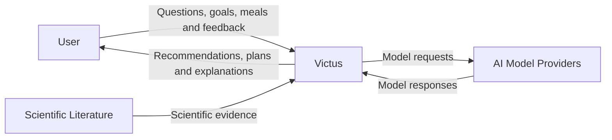

# System Context

Victus is a personalized nutrition system that helps users improve their diet and related habits through personalized recommendations supported by scientific evidence.

This page describes Victus at the **C4 System Context level**. Internal applications, services, databases, and repositories are intentionally omitted.

## Context Diagram

## User

The primary user is an adult who wants to improve nutrition and related habits in a sustainable way.

Victus can support goals such as:

* improving general nutrition;
* losing body fat;
* maintaining weight;
* gaining muscle;
* supporting physical performance;
* improving dietary adherence.

The user primarily interacts with Victus through conversation and can provide goals, preferences, restrictions, meals, activity context, and feedback.

## Victus

Victus is the system responsible for turning user context, scientific evidence, and specialized nutrition capabilities into personalized recommendations.

Its main responsibilities are:

* maintain relevant user context;
* record nutrition-related information;
* retrieve scientific evidence when required;
* execute specialized nutrition tools;
* apply safety rules;
* generate personalized recommendations and explanations.

The conversational agent is the primary interaction mechanism, complemented by structured interfaces for information such as profile data, meals, goals, plans, and progress.

## External Systems

### Scientific Literature

Scientific papers are the source of evidence used to support Victus recommendations.

Victus internally processes this literature into structured and searchable evidence before it is consumed by the recommendation system.

### AI Model Providers

Victus uses external AI models for capabilities such as natural-language understanding, reasoning, structured extraction, and response generation.

Specific providers and models are implementation details and are therefore not represented at this level.

## System Boundary

The Victus system includes the software required to deliver the product:

* user-facing application;
* conversational agent;
* user profile and history;
* nutrition tools;
* scientific processing;
* evidence retrieval;
* safety mechanisms;
* supporting infrastructure.

Scientific literature sources and external AI model providers remain outside the Victus boundary.

Victus focuses on personalized nutrition and directly related healthy habits. It is not intended to diagnose medical conditions or replace professional medical care.
