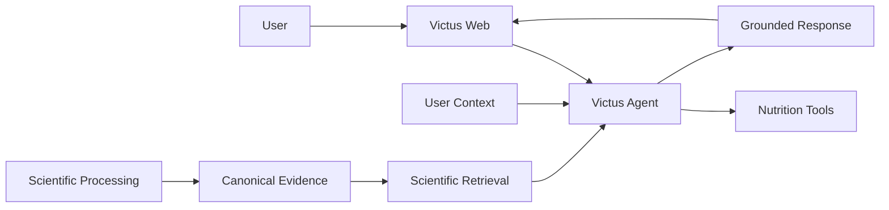

# Current Status

Victus is under active development.

Most major technical subsystems now exist independently, but the complete personalized nutrition workflow is not yet integrated end-to-end.

The current challenge is no longer creating the basic architecture. It is connecting the existing systems into a reliable product path from user context and scientific evidence to personalized recommendations.

## Overall Product State

The current product can already authenticate users, persist conversations, log meals, display user data, execute an Agent conversation, process scientific papers, retrieve scientific claims experimentally, and deploy shared infrastructure.

However, these capabilities are not yet connected into the complete intended experience:

```text
User
  ↓
Victus Web
  ↓
Victus Agent
  ↓
User Profile + Scientific Evidence + Nutrition Tools
  ↓
Personalized Recommendation
  ↓
Progress / Feedback
```

The product should therefore be considered a functional foundation with partial end-to-end integration.

## Capability Status

| Capability | Status | Current State |
| --- | --- | --- |
| Web application | **Advanced / Partial** | React + Hono + PostgreSQL product foundation is functional. Auth, persistent chat, food search, meal logging, profile and biometrics views exist. Several UX flows remain incomplete. |
| Conversational agent | **Partial** | Core LangGraph runtime is functional with safety, tool execution, clarification, confirmation, persistence, and memory boundaries. Active public tooling is still narrow. |
| Meal logging | **Implemented / Partial integration** | Meals can be captured through the Agent and through Fullstack. Fullstack meal delivery to Agent through the outbox is not yet implemented. |
| Authentication & identity | **Implemented / Partial** | Email/password product auth is implemented. Google login exists partially and still needs runtime validation. |
| User profile | **Partial** | Fullstack owns persistent profile, biometrics, and preferences. Agent-side profile capabilities are not yet fully exposed or synchronized. |
| Safety | **Implemented foundation / Partial product maturity** | Agent safety precheck and blocking flow exist. Safety remains an area that requires continued evaluation and policy refinement. |
| Scientific processing | **Advanced** | The scientific processing pipeline is one of the most mature subsystems. Its main role is producing structured scientific evidence for Retrieval. |
| Scientific retrieval | **Experimental / Partial** | Sparse, dense, hybrid/RRF retrieval and evaluation exist. The system is still CLI-first and is not yet a stable product service. |
| Scientific evidence in Agent | **Missing integration** | Retrieval is not yet connected as an active Agent capability. |
| Nutrition planning | **Foundational / Planned capability** | Some domain scaffolding and product UI exist, but there is no complete recommendation/planning workflow. |
| Personalized recommendations | **Planned product milestone** | Requires profile integration, scientific retrieval, nutrition tooling, and final recommendation orchestration. |
| Progress & feedback | **Planned / Early foundation** | Meal history exists, but adherence, progress interpretation, and recommendation adjustment loops are not yet implemented end-to-end. |
| Shared infrastructure | **Advanced foundation / Partial operations** | Runtime topology, deployment automation, networking, persistence, secrets and shared services are defined. Disaster recovery and operational verification remain incomplete. |

## System Status

## `victus-agent`

**Role:** Conversational orchestration and controlled capability execution.

**Status:** Partial, functional runtime.

Implemented:

- LangGraph conversational runtime;
- request normalization;
- bounded conversational memory;
- safety precheck;
- direct response generation;
- controlled tool execution;
- clarification and confirmation flows;
- durable events and projections;
- authenticated identity boundary;
- PostgreSQL-backed runtime state.

The active canonical tool catalog is currently limited to `event_capture`, focused on meal and beverage capture.

The repository contains additional domain structures and scaffolding, but their presence does not mean they are active capabilities.

### Main gaps

- scientific retrieval integration;
- active profile tooling;
- nutrition analysis and planning tools;
- recommendation orchestration;
- progress and feedback loops;
- broader product evaluation.

## `victus-processing`

**Role:** Transform scientific papers into structured scientific evidence.

**Status:** Advanced development.

The processing system represents one of the strongest foundations in Victus.

Its architecture covers paper structuring, scientific evidence extraction, artifact generation, and downstream publication.

The intended downstream boundary is structured Canonical Evidence that Retrieval can index without redefining scientific meaning.

### Main gaps

The remaining work is primarily around:

- finalizing the production artifact publication path;
- difficult document edge cases;
- maintaining high extraction coverage;
- strengthening the Processing → Retrieval contract.

The core scientific processing problem is substantially further along than product integration.

## `victus-rag`

**Role:** Scientific evidence retrieval and ranking.

**Status:** Experimental / Partial.

The current repository is best described as a CLI-first retrieval and evaluation laboratory.

Implemented:

- claim-level BM25 retrieval;
- dense retrieval using Qdrant;
- hybrid retrieval using Reciprocal Rank Fusion;
- local query embedding with BGE-M3;
- local retrieval evaluation;
- BEIR-compatible evaluation;
- retrieval artifacts;
- optional OpenTelemetry tracing.

The currently verifiable complete path is primarily retrieval-oriented rather than product-oriented:

```text
query
  ↓
retrieval
  ↓
ranked scientific claims
```

It does not currently generate final answers.

### Main gaps

- ingest current Canonical Evidence directly from `victus-processing`;
- establish versioned and reproducible index builds;
- expose a stable retrieval service/API;
- integrate with `victus-agent`;
- implement reranking;
- implement metadata filtering;
- validate dense/hybrid runtime availability;
- establish evaluation gates for retrieval changes.

The key milestone is not more retrieval experimentation. It is completing:

```text
Scientific Processing
        ↓
Scientific Retrieval
        ↓
Victus Agent
```

## `victus-fullstack`

**Role:** User-facing Victus web product.

**Status:** Advanced foundation / Partial product.

The current application architecture is:

```text
Browser
  ↓
React / Vite
  ↓
Hono Backend
  ↓
PostgreSQL
  └→ Victus Agent
```

Implemented:

- email/password authentication;
- JWT access and rotating refresh sessions;
- CSRF protection;
- persistent conversations;
- chat history and archival;
- HTTP Agent gateway;
- FoodB lexical search;
- meal CRUD;
- profile reads;
- biometrics reads;
- preferences reads;
- language settings;
- navigable product interface.

Partial:

- Google authentication;
- onboarding;
- biometrics/preferences editing UX;
- weekly meal experience;
- FoodB database materialization;
- integrated observability.

Some product areas remain demo representations rather than connected capabilities.

Examples include static evidence cards, nutrition-focus content, and chat trace displays.

### Important integration gap

Fullstack meal writes create a transactional `meal_import_outbox` entry, but there is currently no publisher delivering those events to Victus Agent.

Therefore:

```text
Meal Log
   ↓
Fullstack PostgreSQL
   ↓
Outbox
   ↓
[delivery not implemented]
```

Chat is currently the primary active Fullstack → Agent integration.

## `victus-infra`

**Role:** Shared runtime infrastructure.

**Status:** Advanced foundation / Partial operational maturity.

The repository defines four primary Compose stacks:

```text
core
observability
llm
wiki
```

Implemented and statically validated:

- Docker Compose runtime definitions;
- VPS deployment through Ansible;
- GitHub Actions deployment flow;
- Infisical secret retrieval through GitHub OIDC;
- SeaweedFS S3;
- PostgreSQL;
- Redis with AOF and Streams;
- etcd and CoreDNS;
- private Tailscale-based networking;
- private and public NGINX;
- Prometheus;
- Loki;
- Alloy;
- LiteLLM;
- Langfuse;
- Wiki.js;
- persistent host data paths.

The main deployment model is:

```text
GitHub Actions
      ↓
Infisical
      ↓
Ansible
      ↓
VPS
      ↓
Docker Compose
```

### Operational limitations

The repository is well defined, but the latest audit could not verify production health directly.

Important missing production-hardening capabilities include:

- automated backups;
- offsite backup copies;
- tested restore procedures;
- RPO/RTO;
- alerting;
- dashboards;
- full service monitoring;
- explicit certificate lifecycle validation;
- verified consumer inventory.

The current infrastructure protects reasonably against container restarts and redeployments, but not against complete VPS or disk loss.

## `victus-docs`

**Role:** Central architecture and ecosystem documentation.

**Status:** Active consolidation.

Wiki.js at `wiki.victus.fit` is the canonical documentation system.

The main system documentation is now organized around:

```text
architecture/
  system-context
  containers
  data-flow

systems/
  scientific-processing
  agent
  retrieval
  fullstack
  infrastructure
```

Repository documentation should remain focused on implementation and operations.

The next documentation phase is consolidating only the shared cross-system contracts and ecosystem-level decisions that genuinely require a central source.

## Integration State

The main systems currently exist at different integration levels.

```text
Fullstack ───────→ Agent
   ✓ chat boundary implemented

Processing ─────→ Retrieval
   ✗ current Canonical Evidence integration not complete

Retrieval ──────→ Agent
   ✗ not integrated

Fullstack Meals → Agent
   ~ outbox exists, publisher missing
```

This integration map is more useful than treating repository maturity as a single percentage.

## Data and Runtime Environments

Victus currently uses different environments according to workload and subsystem.

| Resource | Current Role |
| --- | --- |
| Development machines | Application development, local testing, experimentation, and CLI workflows. |
| Home compute | Scientific processing workloads and local experimentation where appropriate. |
| VPS / Hetzner | Shared Victus infrastructure runtime. |
| SeaweedFS | Shared S3-compatible object storage in the infrastructure stack. |
| External/versioned storage | Historical scientific artifacts and snapshots may also exist outside the active shared runtime depending on workflow. |
| PostgreSQL | Durable state across Fullstack, Agent, infrastructure services, and other subsystem-specific databases. |
| Qdrant | Current vector backend used by Retrieval when available; not currently part of `victus-infra`. |

The exact runtime source of truth for each subsystem remains its owning repository.

## Current Priorities

The previous priority list placed Safety first.

With the current system state, the highest-leverage work has shifted toward integration.

A practical order is:

1. **Scientific Processing → Retrieval**
2. **Versioned Retrieval indexes**
3. **Retrieval service boundary**
4. **Retrieval → Agent integration**
5. **Profile and restriction integration**
6. **Nutrition analysis, planning, and recommendation tooling**
7. **Progress, adherence, and feedback loops**
8. **Operational hardening**

Safety remains a cross-cutting requirement throughout these phases rather than a single isolated milestone.

## Near-Term Product Milestone

The most important next milestone is:

> A user asks Victus a nutrition question, the Agent retrieves versioned scientific evidence produced by Scientific Processing, combines it with relevant user context, and returns a grounded response.

Conceptually:



This milestone closes the most important architectural gap currently present in Victus.

## Main Technical Gaps

The most important remaining gaps are:

### Cross-system integration

The individual subsystems are ahead of the connections between them.

### Retrieval serving

Retrieval needs to move from CLI-first experimentation toward a stable application boundary.

### Canonical evidence indexing

Retrieval needs to consume the current scientific evidence contract rather than older claim-oriented artifacts.

### User context integration

The product and Agent both have useful user-state foundations, but their ownership and synchronization paths need to be completed.

### Nutrition tooling

Meal capture exists, but the product still lacks the complete analysis, planning, recommendation, and adjustment workflow.

### Operational hardening

Infrastructure needs backup, restore, alerting, production verification, and better operational coverage.

## Overall State

Victus is no longer primarily an architecture prototype.

It contains real implementations for:

- the web product;
- conversational runtime;
- scientific processing;
- retrieval experimentation and evaluation;
- shared infrastructure.

The central challenge is now system integration.

A useful summary is:

```text
Individual foundations
        ✓

Cross-system contracts
        ~

End-to-end recommendation path
        ✗

Production hardening
        ~
```

The next stage of Victus development should prioritize completing one reliable vertical path rather than expanding the number of partially connected capabilities.