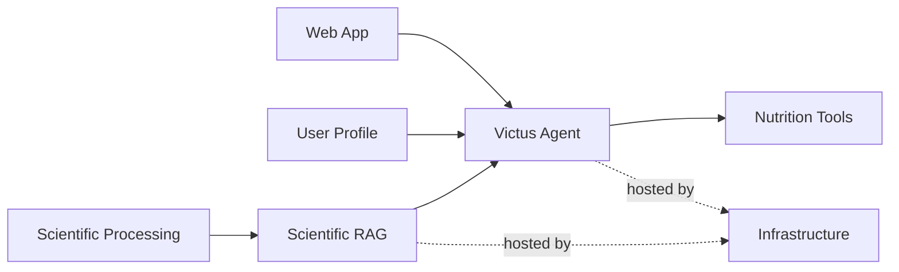

# Current Status

Victus is under active development. The main foundations of the platform already exist, but the complete personalized nutrition workflow is still being integrated.

The current priority is connecting the scientific evidence, safety, user profile, and nutrition tooling into a complete agent experience.

## Product Status

| Capability                   | Status          | Current State                                                                                         |
| ---------------------------- | --------------- | ----------------------------------------------------------------------------------------------------- |
| Web application              | **Partial**     | `victus-fullstack` is in advanced development.                                                        |
| Conversational agent         | **Partial**     | Core runtime is functional, but the complete nutrition workflow is not yet available.                 |
| Meal logging                 | **Implemented** | Meals and beverages can be captured through the agent.                                                |
| User profile                 | **Partial**     | Domain and supporting infrastructure exist, but profile tooling is not fully exposed to the agent.    |
| Safety                       | **Partial**     | Safety infrastructure exists and is one of the main areas currently being refined.                    |
| Scientific evidence          | **Partial**     | Processing and retrieval systems exist, but evidence is not yet fully integrated into the agent flow. |
| Nutrition planning           | **Partial**     | Planning foundations exist but are not yet a complete user-facing capability.                         |
| Personalized recommendations | **Planned**     | Depends on completing safety, evidence retrieval, profile integration, and nutrition tooling.         |
| Progress & feedback          | **Planned**     | Meal capture exists, but adherence and recommendation adjustment are not yet complete.                |

## System Status

### `victus-agent`

Core conversational runtime and orchestration.

**Status:** Partial

Implemented foundations include authentication context, event storage, projections, clarification and confirmation flows, and tool execution.

The active conversational tooling is currently limited mainly to meal and beverage capture.

**Current focus:**

* refine the safety flow;
* connect scientific retrieval;
* expose profile tooling;
* complete nutrition planning and recommendation tools;
* implement progress and feedback loops.

### `victus-processing`

Scientific paper processing pipeline.

**Status:** Advanced development

Its purpose is to transform scientific papers into structured artifacts that can be consumed by the retrieval system.

Processing v1 is largely complete. Remaining work includes handling very large tables and generating the final `CanonicalEvidence` and `Blocks` Parquet artifacts.

### `victus-rag`

Scientific evidence retrieval system.

**Status:** Advanced development

Its responsibility is to index, retrieve, rank, and expose scientific evidence to the Victus Agent.

**Current focus:**

* connect processed scientific artifacts;
* implement LLM reranking;
* evaluate embedding strategies;
* integrate Qdrant into infrastructure;
* complete retrieval observability;
* connect retrieval to the agent.

### `victus-fullstack`

User-facing web application.

**Status:** Advanced development

Provides the main product interface for interacting with Victus.

The chat is intended to remain the primary interaction model, complemented by structured interfaces for information that should be visible and editable, such as profile, goals, meals, plans, and progress.

### `victus-infra`

Shared infrastructure for the Victus platform.

**Status:** Development

The infrastructure currently includes services such as PostgreSQL, SeaweedFS, LiteLLM, NGINX, CoreDNS, etcd, and supporting platform services.

The main infrastructure runs on Hetzner and communicates privately through Tailscale.

**Current focus:**

* integrate the RAG stack;
* improve observability;
* formalize storage contracts;
* complete service deployment and configuration.

### `victus-docs`

Central documentation for Victus.

**Status:** Development

Wiki.js is hosted at `wiki.victus.fit` and will become the canonical documentation source for architecture, system state, contracts, operations, and technical decisions.

Repository READMEs should remain focused on local development and link back to this documentation.

## Data & Compute

Victus currently uses different environments according to workload:

| Resource         | Role                                                                                              |
| ---------------- | ------------------------------------------------------------------------------------------------- |
| **Notebook**     | Development and experimentation.                                                                  |
| **Home server**  | Scientific processing workloads.                                                                  |
| **Hetzner**      | Main platform infrastructure.                                                                     |
| **Backblaze B2** | Versioned data lake for original artifacts, final JSONL/Parquet datasets, and artifact snapshots. |

## Current Priorities

Development should currently proceed in this order:

1. **Safety**
2. **Scientific RAG integration**
3. **User profile and restrictions**
4. **Nutrition planning and recommendation tooling**
5. **Progress, adherence, and feedback**
6. **Operational hardening**

The first three are prerequisites for delivering reliable personalized nutrition recommendations.

## Overall State

Victus already has most of the major architectural pieces required for the intended product:

The main challenge is no longer creating the individual foundations, but integrating them into a reliable end-to-end nutrition recommendation system.
