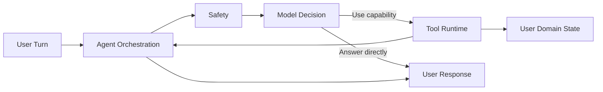
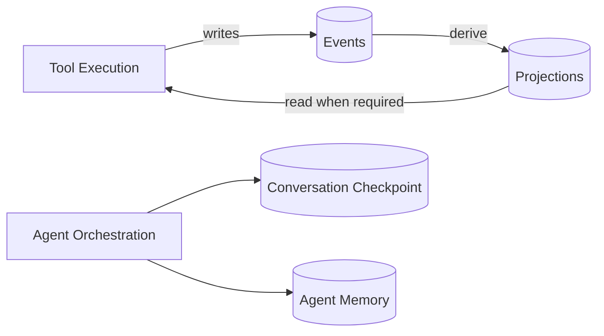
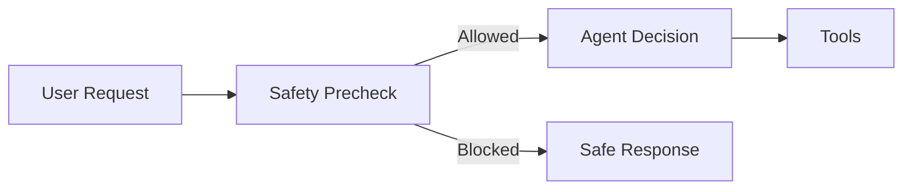

# Agent

Victus Agent is the conversational orchestration runtime of Victus.

It receives authenticated user interactions, applies safety controls, decides whether to answer directly or execute a capability, coordinates user clarification or confirmation when required, and produces the final response.

The Agent does not own the user interface, scientific processing, or scientific retrieval. Its responsibility is to coordinate those capabilities as part of a safe and stateful conversation.

## Responsibility

The Agent is responsible for:

* orchestrating conversational turns;
* applying safety checks before actions are executed;
* selecting and executing registered tools;
* preserving bounded conversational continuity;
* coordinating clarification and confirmation;
* recording durable user events;
* accessing rebuildable user state;
* interacting with AI models;
* producing the final user-facing response.

The Agent does not treat model output as authoritative state. Persistent user facts must pass through controlled domain and tool boundaries.

## Architecture

The runtime follows a **tool-first architecture**.

The model can either produce a response or propose a tool invocation. Proposed actions are validated and executed by the runtime rather than being applied directly by the model.



A turn may also pause when the Agent requires additional user input.

This allows the runtime to request clarification for incomplete actions or confirmation before actions that require explicit approval.

### Turn Orchestration

A normal conversational turn follows approximately:

```text
User Request
    ↓
Request Normalization
    ↓
Conversation Memory
    ↓
Safety
    ↓
Decision
   / \
Response  Tool Execution
             ↓
       Clarification / Confirmation
             ↓
          Response
```

Not every interaction executes a tool.

The Agent may answer directly, execute a capability, request clarification, request confirmation, or block the interaction when safety requirements are not satisfied.

The exact LangGraph nodes and routing rules are implementation details documented inside `victus-agent`.

### Tool Execution

Tools are the controlled boundary between model reasoning and application behavior.

The model may propose an action, but the runtime remains responsible for validating and executing it.

Conceptually:

```text
Model Proposal
      ↓
Tool Contract
      ↓
Validation
      ↓
Safety / Identity
      ↓
Tool Execution
      ↓
Structured Result
```

Tools use typed inputs and return a common structured result.

A tool execution may:

* succeed;
* require clarification;
* be blocked;
* be rejected;
* fail with an execution error.

State-changing tools persist durable changes through controlled handlers rather than allowing the model to modify application state directly.

## State and Memory

Victus deliberately separates domain state from conversational state.

The main categories are:



These stores have different responsibilities and should not be treated as interchangeable.

### Events and Projections

**Events** represent durable historical facts.

Examples include a recorded meal or another accepted user action.

Events are immutable and provide the historical source of truth for domain changes.

**Projections** are rebuildable views derived from those events.

They provide efficient access to current user state without replaying the complete event history for every operation.

Conceptually:

```text
Events
  ↓
historical truth

Projections
  ↓
current rebuildable state
```

Tools may read the projections they require when executing an action.

The conversational graph does not make projections themselves the source of truth and does not allow the model to write them directly.

### Conversation State

Conversational continuity is handled separately.

**LangGraph checkpoints** preserve the execution state required to continue a conversation, including interrupted clarification or confirmation flows.

**Agent memory** stores a bounded amount of non-domain conversational or procedural context that may be useful across turns.

Therefore:

```text
Events        ≠ Conversation Memory
Projections   ≠ LangGraph State
LLM Output    ≠ Domain Truth
```

Meals, restrictions, goals, plans, biometrics, and other durable domain information must remain backed by the domain state rather than conversational memory.

## Safety

Safety is evaluated before model-directed capability execution.



When a request is blocked, state-changing tools are not made available for execution.

Model output is also treated as untrusted input to the execution layer. A proposed action must still satisfy tool contracts, authenticated identity constraints, runtime policies, and any required confirmation before it can produce a persistent change.

This creates a simple rule:

> No persistent action should bypass the Agent's safety and tool execution boundaries.

## Persistence

PostgreSQL provides durable persistence for the Agent runtime.

Conceptually, the Agent stores:

* immutable user events;
* rebuildable projections;
* conversation checkpoints;
* bounded conversational memory;
* runtime information required for continuity and traceability.

The database schema itself is defined by code and migrations.

The Wiki documents the persistence model conceptually rather than reproducing the physical database schema.

## External Dependencies

The Agent integrates with several systems outside its own boundary.

**Victus Web Application**

Provides the user-facing experience and sends authenticated interactions to the Agent.

**Victus Backend / Identity**

Provides authenticated user identity and external profile information required by the runtime.

**AI Model Providers**

Provide model inference used for reasoning, tool selection, response generation, and safety where configured.

Model access is abstracted from the Agent runtime so provider-specific behavior does not become a domain responsibility.

**PostgreSQL**

Provides durable runtime, event, projection, checkpoint, and memory persistence.

**Victus Evidence Retrieval**

Victus RAG is the architectural source of scientific evidence for evidence-grounded recommendations.

Scientific retrieval is not currently an active capability of the conversational runtime and should remain a separate subsystem rather than becoming part of the Agent's internal persistence model.

## Current Scope

The current Agent is a **testable first-version runtime**, not yet the complete Victus nutrition advisor.

Its active conversational capability is currently focused on capturing consumed meals and beverages through `event_capture`.

The repository also contains domain structures and implementation groundwork for additional capabilities, but their presence in the codebase does not mean they are active parts of the current conversational runtime.

New capabilities should be considered active only when their implementation, tool registration, runtime exposure, safety behavior, and contracts agree.

## Design Principles

### Tool-first orchestration

Models propose actions. Controlled runtime code executes them.

### Durable domain truth

Events are authoritative historical facts. Projections are derived state.

### Bounded conversational state

Conversation checkpoints and memory exist for continuity, not as alternative domain databases.

### Explicit safety boundaries

Unsafe or invalid actions must not reach persistent execution.

### Authenticated ownership

User identity is provided and validated outside model control.

### Shared capability runtime

Capabilities should have one implementation and consistent behavior regardless of the interface that invokes them.

### Clear subsystem boundaries

The Agent orchestrates Victus capabilities but should not absorb responsibilities belonging to scientific processing, retrieval, the web application, or infrastructure.

### Code as implementation truth

The Wiki explains how the Agent works conceptually.

The `victus-agent` repository defines exact graph routes, tool schemas, persistence behavior, runtime configuration, operations, and implementation details.
