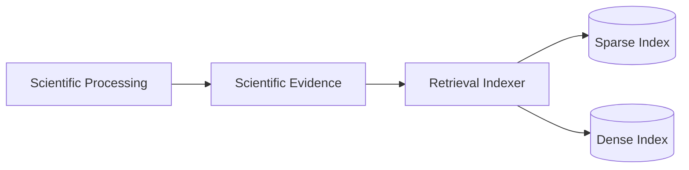
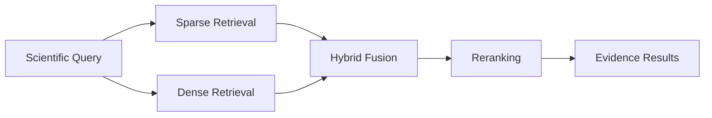

# Retrieval

Victus Retrieval is the subsystem responsible for finding and ranking scientific evidence that can support nutrition and healthy-lifestyle decisions.

Its role is to transform a scientific information need into a small, traceable set of relevant evidence units that another Victus subsystem can reason over.

Retrieval does not generate the final user-facing answer. Final reasoning, conversational behavior, safety coordination, and response generation remain responsibilities of the Agent.

## Responsibility

Retrieval is responsible for:

- indexing scientific evidence produced by the scientific processing pipeline;
- supporting sparse, dense, and hybrid retrieval;
- ranking scientific evidence for a given query;
- preserving provenance back to the original scientific source;
- exposing retrieval results through a stable service boundary;
- evaluating retrieval quality with reproducible datasets and metrics;
- maintaining versioned and reproducible indexes;
- exposing retrieval telemetry for inspection and debugging.

Retrieval does not own:

- PDF parsing;
- scientific evidence extraction;
- scientific synthesis;
- user profile management;
- conversational orchestration;
- final natural-language answer generation;
- safety decisions for the complete user interaction.

## Architecture

The subsystem has two main responsibilities:

1. build searchable indexes from processed scientific evidence;
2. retrieve and rank evidence for downstream consumers.



Scientific Processing remains the authoritative producer of scientific evidence.

Retrieval creates search-oriented representations of that evidence but must not redefine its scientific meaning.

## Retrieval Flow

A retrieval request is evaluated across multiple retrieval strategies and reduced to a small ranked evidence set.



Sparse retrieval provides lexical matching.

Dense retrieval provides semantic matching through vector similarity.

Hybrid retrieval combines both candidate sets. The current retrieval implementation uses Reciprocal Rank Fusion (RRF) for this combination.

A reranking stage can then apply a more precise model to the reduced candidate set before results are returned.

Reranking is part of the target retrieval architecture but is not yet implemented in the current runtime.

## Scientific Evidence Model

The retrieval unit should correspond to a stable scientific evidence unit produced by `victus-processing`.

The intended source is Canonical Evidence.

Conceptually:

```text
CanonicalEvidence
      ↓
RetrievalDocument
      ↓
Sparse / Dense indexes
```

A retrieval document contains only the search-oriented representation required by this subsystem.

Conceptually:

```text
RetrievalDocument
- canonical_evidence_id
- paper_id
- experiment_id
- evidence_text
- scientific metadata
- provenance
- embedding
```

The canonical evidence contract remains owned by Scientific Processing.

Retrieval may add index-specific fields such as embeddings, retrieval metadata, or backend identifiers, but must preserve the canonical evidence identifier and source provenance.

## Indexing

Indexing converts scientific evidence into the persistence structures required by retrieval.

The desired indexing flow is:

```text
Published Scientific Evidence
        ↓
Input Validation
        ↓
Retrieval Document Construction
        ↓
Embedding Generation
        ↓
Sparse Index + Dense Index
        ↓
Index Manifest
```

Each index build should be reproducible.

An index version should identify at least:

- the source evidence artifact;
- source artifact hash;
- scientific contract version;
- embedding model;
- embedding dimensions;
- normalization behavior;
- retrieval configuration;
- code version;
- evidence count;
- paper count.

Dense indexes are stored in Qdrant.

Index versions should be immutable once published. A stable alias can identify the index currently used by the retrieval service.

This prevents partially updated or stale collections from becoming part of the active retrieval corpus.

## Sparse Retrieval

Sparse retrieval provides lexical matching over the evidence text.

The current implementation uses a local BM25-style index.

Sparse retrieval is useful for queries where exact scientific terminology, intervention names, outcomes, compounds, or other explicit terms are important.

It remains independent from the dense vector index.

## Dense Retrieval

Dense retrieval provides semantic matching.

The current vector backend is Qdrant.

Scientific evidence is embedded before indexing, while incoming queries are embedded at retrieval time.

The current default embedding family is BGE-M3.

Corpus and query embeddings must remain compatible. The retrieval runtime should validate embedding model identity, dimensionality, and normalization configuration before serving an index.

## Hybrid Retrieval

Hybrid retrieval combines sparse and dense candidate rankings.

The current implementation uses Reciprocal Rank Fusion.

Conceptually:

```text
Sparse Candidates
               → RRF → Candidate Set
       /
Dense Candidates
```

Fusion improves robustness by combining lexical and semantic retrieval behavior without requiring their raw similarity scores to be directly comparable.

The fused candidate set may later be passed through a reranker.

## Reranking

Reranking is a second-stage ranking step applied to a relatively small candidate set.

Conceptually:

```text
Hybrid Retrieval
      ↓
30-100 candidates
      ↓
Reranker
      ↓
5-15 evidence units
```

This stage should remain configurable and measurable against the retrieval evaluation dataset.

The choice of reranking model should be based on evaluation quality and acceptable latency rather than being treated as a fixed architectural dependency.

## Metadata Filtering

Scientific metadata can be used to constrain retrieval when the request requires a narrower evidence population.

Examples may include:

- organism or population;
- intervention;
- outcome;
- evidence type;
- assertion type;
- experiment or paper attributes.

Filters operate over indexed metadata and must not change the meaning of the underlying scientific evidence.

The retrieval service should support filters as an optional capability rather than requiring every query to use them.

## Grounding and Provenance

Every returned evidence unit must preserve enough information to trace it back to its scientific origin.

At minimum, a retrieval result should preserve:

```text
canonical_evidence_id
paper_id
experiment_id
evidence_text
source observations / source blocks
retrieval score
index version
```

Retrieval scores indicate ranking relevance.

They do not represent scientific confidence, clinical certainty, or strength of evidence.

Scientific meaning and confidence must remain separate from retrieval ranking.

## Service Boundary

The product-facing Retrieval subsystem should expose a small stable interface.

Conceptually:

```text
retrieve(query, filters, top_k)
        ↓
EvidenceBundle
```

An HTTP service may expose this boundary internally to other Victus systems.

```text
POST /retrieve
GET  /health
```

The CLI can remain available for development, indexing, evaluation, and debugging, but it should delegate to the same retrieval application layer used by the service.

The main product consumer is the Victus Agent.


The Agent remains responsible for interpreting the evidence and generating the final conversational response.

## Evaluation

Retrieval quality must be measured independently from final answer quality.

The subsystem supports retrieval evaluation using query sets with known relevant evidence identifiers.

Important metrics include:

- Recall@K;
- MRR;
- nDCG;
- Precision@K;
- MAP where useful.

Sparse, dense, hybrid, and reranked strategies should be compared against the same versioned evaluation dataset.

Evaluation outputs should include both aggregate metrics and per-query rankings so retrieval failures can be inspected directly.

A production retrieval change should not replace the active retrieval configuration without passing an agreed evaluation threshold.

## Observability

Retrieval telemetry should make it possible to inspect:

- the query;
- retrieval backend;
- index version;
- top-k;
- returned evidence identifiers;
- ranking scores;
- latency;
- selected retrieval configuration.

Telemetry is observational and must not change ranking behavior.

The current implementation emits retrieval traces through OpenTelemetry and can use Phoenix as an OTLP-compatible trace viewer.

## Persistence

The main persistent retrieval structures are:

- sparse index artifacts;
- dense vector collections in Qdrant;
- index manifests;
- evaluation datasets;
- evaluation outputs and ranking artifacts.

Scientific source data remains owned by the Scientific Processing subsystem.

Retrieval persistence is derived and should therefore be reproducible from published scientific evidence and versioned retrieval configuration.

## External Dependencies

**Victus Scientific Processing**

Produces the scientific evidence that forms the retrieval corpus.

**Qdrant**

Stores dense vectors and associated retrieval metadata.

**Embedding Models**

Create vector representations for evidence and queries.

**Victus Agent**

Consumes ranked scientific evidence and uses it during grounded reasoning and response generation.

**OpenTelemetry Collector**

Receives optional retrieval audit telemetry. Phoenix may be used as a local visualization backend.

## Current Scope

The current `victus-rag` repository is primarily a CLI-first retrieval and evaluation laboratory.

It currently provides:

- claim-level sparse retrieval;
- dense retrieval backed by Qdrant;
- hybrid retrieval using RRF;
- local retrieval evaluation;
- BEIR-compatible evaluation;
- retrieval artifacts and telemetry.

The current runtime does not yet provide:

- direct ingestion from the current Canonical Evidence contract;
- a production retrieval API;
- integration with `victus-agent`;
- reranking;
- metadata filters;
- strong index manifests and immutable index publication;
- final answer generation.

The repository should therefore be considered the experimental implementation foundation of the Retrieval subsystem rather than a finished product service.

## Design Principles

### Retrieval, not answer generation

Retrieval finds and ranks scientific evidence. The Agent remains responsible for reasoning and the final response.

### Scientific evidence remains canonical

Retrieval derives searchable representations from evidence produced by Scientific Processing but must not redefine the scientific contract.

### Reproducible indexes

Every active index should be traceable to an exact scientific corpus, embedding model, retrieval configuration, and code version.

### Provenance first

A retrieved result must remain traceable to the evidence and paper from which it originated.

### Evaluation before optimization

Changes to retrieval strategy should be justified through repeatable evaluation rather than intuition alone.

### Derived persistence

Sparse and dense indexes are replaceable derived state and should be rebuildable from canonical scientific evidence.

### Small service boundary

The product interface should expose retrieval behavior without exposing indexing, evaluation, or backend implementation details.

### Implementation truth remains in code

The Wiki explains the conceptual subsystem architecture.

The `victus-rag` repository defines exact CLI commands, index formats, configuration, Qdrant behavior, evaluation workflows, telemetry details, and operational procedures.