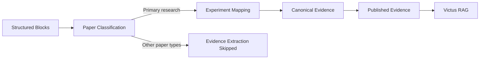
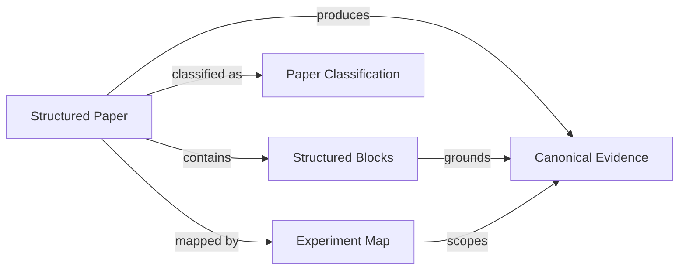
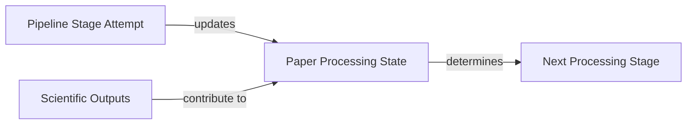

# Scientific Processing

`victus-processing` transforms scientific papers into structured, traceable evidence that can be consumed by the Victus retrieval system.

The pipeline is designed around explicit processing stages, durable artifacts, and reproducible execution.

Scientific processing and retrieval are intentionally separated: `victus-processing` produces scientific evidence, while `victus-rag` is responsible for indexing and retrieving it.

## Architecture

The pipeline can be understood in two main phases: **paper structuring** and **evidence extraction**.

### Paper Structuring


This phase discovers scientific publications, associates their metadata with a PDF, converts the document into structured content, and produces stable `StructuredBlock` records.

### Evidence Extraction



Only primary research papers continue through the main evidence extraction path.

The result is traceable scientific evidence prepared for downstream retrieval.

## Pipeline

### 1. Paper Discovery & Intake

Scientific papers enter the pipeline through metadata discovery or explicit DOI input.

Metadata is normalized before the corresponding PDF is associated with the paper.

PDF acquisition remains separate from the core processing pipeline. Once obtained, a PDF is linked to its metadata and promoted to a canonical paper artifact.

### 2. PDF Processing

PDF documents are converted into Markdown using Docling and then processed into structured scientific content.

The main output is a collection of **Structured Blocks** representing stable units of scientific content while preserving document structure, ordering, and context.

Model-assisted processing is used where deterministic document parsing is insufficient.

### 3. Paper Classification

Processed papers are classified according to how they generate scientific knowledge.

Only papers classified as primary research continue through the main evidence extraction pipeline.

This prevents reviews, background material, and other non-primary publications from being treated as direct experimental evidence.

### 4. Evidence Preparation

Only sections relevant to evidence extraction continue downstream.

The pipeline primarily preserves:

* methods;
* results;
* discussion;
* conclusion.

Filtering operates on complete Structured Blocks and does not rewrite or summarize their content.

### 5. Experiment Mapping

Related Structured Blocks are grouped into study or experiment scopes.

The resulting **Experiment Map** defines which source blocks should be interpreted together during evidence extraction.

Experiment mapping organizes scientific context but does not itself generate findings or conclusions.

### 6. Canonical Evidence Extraction

Each experiment scope can produce one or more **Canonical Evidence** records.

Canonical Evidence represents a single scientific result relation while preserving traceability to the Structured Blocks that support it.

It is designed for downstream retrieval, ranking, synthesis, and reasoning without containing retrieval scores or user-facing recommendations.

## Main Artifacts

| Artifact                | Purpose                                                       |
| ----------------------- | ------------------------------------------------------------- |
| **Paper**               | Canonical identity and metadata for a scientific publication. |
| **StructuredBlock**     | Stable unit of structured scientific content.                 |
| **PaperClassification** | Determines how a paper contributes scientific evidence.       |
| **ExperimentMap**       | Groups source blocks into study or experiment scopes.         |
| **CanonicalEvidence**   | Normalized and traceable scientific result.                   |

Detailed schemas and invariants are maintained in the [Scientific Contracts](../contracts/scientific/).


## Persistence Model

PostgreSQL stores the durable scientific outputs produced by the processing pipeline together with the state required to track paper processing.

The persistence model separates **scientific data** from **pipeline execution state**.

### Scientific Data



The main scientific relationship is:

```text
Paper
  ↓
Structured Blocks
  ↓
Experiment Map
  ↓
Canonical Evidence
```

`PaperClassification` acts as a gate that determines whether a processed paper should continue through the primary evidence extraction path.

Canonical Evidence remains traceable to both the experiment scope and the Structured Blocks that support it.

The most relevant identities are:

| Object             | Identity                |
| ------------------ | ----------------------- |
| Structured Paper   | `paper_id`              |
| Structured Block   | `block_id`              |
| Experiment Map     | `experiment_map_id`     |
| Canonical Evidence | `canonical_evidence_id` |

Detailed fields belong to the scientific contracts and physical database schema rather than this architectural view.

### Processing State



The processing state has two different responsibilities:

* **Pipeline stage state** records individual execution attempts, including stage, status, run, and errors.
* **Paper processing state** provides a derived view of the overall progress of a paper through the pipeline.

Keeping execution state separate from scientific outputs prevents operational concerns from becoming part of the scientific domain model.

### Source of Truth

These diagrams describe the persistence model conceptually and intentionally omit implementation details.

The PostgreSQL schema and migrations maintained by `victus-processing` are the authoritative source for physical tables, columns, constraints, indexes, and data types.


## State & Traceability

Pipeline execution state is kept separate from scientific outputs.

Paper-level stage state allows processing to be inspected, resumed, and audited without mixing operational metadata with scientific contracts.

Scientific outputs are persisted in PostgreSQL, while processing artifacts provide additional traceability and debugging information.

## Publication

Validated scientific outputs are prepared as durable datasets for downstream systems.

Final datasets can be versioned in object storage and consumed by `victus-rag` for indexing and retrieval.

The system boundary is intentionally clear:

```text
victus-processing
        ↓
Scientific Evidence
        ↓
victus-rag
        ↓
Victus Agent
```

`victus-processing` owns evidence generation.

It does not own:

* vector indexing;
* semantic retrieval;
* reranking;
* agent reasoning;
* personalized nutrition recommendations.

## External Dependencies

The main external dependencies are:

* **Docling** — PDF-to-Markdown conversion.
* **Semantic Scholar** — scientific metadata and citation information.
* **LiteLLM** — model routing for LLM-assisted processing.
* **PostgreSQL** — scientific outputs and pipeline state.
* **Object Storage** — durable and versioned processing artifacts.

Implementation-specific commands, configuration, local artifacts, and operational procedures remain documented in the `victus-processing` repository.

## Design Principles

Scientific Processing follows a small set of architectural principles:

* **Explicit stages** — processing steps have clear boundaries.
* **Traceability** — evidence remains connected to its source material.
* **Reproducibility** — stages can be rerun from persisted inputs.
* **Inspectability** — intermediate and final artifacts can be reviewed.
* **Separation of concerns** — processing produces evidence; retrieval and product behavior remain downstream.
