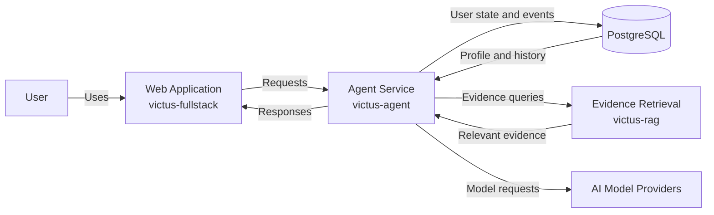
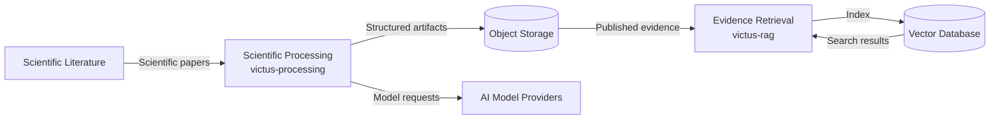

# Containers

This document describes the main applications and data stores that compose Victus.

For readability, the container architecture is shown in two views:

1. **Product Containers** — components involved in the user-facing experience.
2. **Scientific Evidence Containers** — components responsible for processing and retrieving scientific evidence.

Both diagrams represent the same C4 Container level.

Implementation progress is documented separately in [Current Status](../overview/current-status).

---

## Product Containers

This view represents the main path followed when a user interacts with Victus.

The Web Application provides the interface, while the Agent Service coordinates user context, tools, safety, scientific evidence, and response generation.

---

## Scientific Evidence Containers

This view represents how scientific literature is transformed into evidence that can later be retrieved by the Agent Service.

Scientific processing is intentionally separated from retrieval so that evidence generation, publication, indexing, and consumption can evolve independently.

---

## Container Responsibilities

### Web Application

**Repository:** `victus-fullstack`

The user-facing application for Victus.

Responsibilities:

* provide the conversational interface;
* expose structured views for profile, meals, goals, plans, and progress;
* send user actions to the Agent Service;
* present recommendations and relevant information.

The chat is the primary interaction model, complemented by structured interfaces for information that should remain visible and editable.

### Agent Service

**Repository:** `victus-agent`

The central orchestration layer of Victus.

Responsibilities:

* interpret user requests;
* load relevant user context;
* apply safety controls;
* coordinate tools;
* request scientific evidence;
* manage persistent user events;
* generate responses.

The Agent Service coordinates other capabilities rather than implementing scientific processing or retrieval directly.

### Evidence Retrieval

**Repository:** `victus-rag`

Provides scientific evidence to the Agent Service.

Responsibilities:

* index published scientific evidence;
* retrieve relevant evidence;
* rank and rerank results;
* return evidence with the metadata required for traceability.

### Scientific Processing

**Repository:** `victus-processing`

Transforms scientific papers into structured evidence that can later be consumed by the retrieval system.

Responsibilities:

* paper ingestion and classification;
* document parsing;
* structured block generation;
* evidence extraction;
* artifact validation;
* publication of final datasets.

Scientific Processing runs independently from the user-facing application.

### PostgreSQL

Stores transactional and application state required by Victus.

This includes data such as:

* user events;
* derived projections;
* agent state;
* processing state where applicable.

Detailed schemas belong to the relevant system or contract documentation.

### Object Storage

Stores scientific source material and generated artifacts.

Victus uses object storage for:

* original papers;
* intermediate processing artifacts;
* final JSONL and Parquet datasets;
* versioned artifact snapshots.

Backblaze B2 acts as the persistent versioned data lake.

### Vector Database

Stores the indexes used by the Evidence Retrieval system.

It enables `victus-rag` to efficiently search the scientific evidence produced by `victus-processing`.

---

## External Dependencies

### AI Model Providers

External models provide capabilities such as:

* natural-language understanding;
* reasoning;
* structured extraction;
* response generation.

Victus accesses these providers through internal abstractions rather than coupling the product to a specific model.

### Scientific Literature

Scientific publications are the source material from which Victus builds its evidence base.

They remain outside the Victus system boundary until they are ingested by Scientific Processing.
