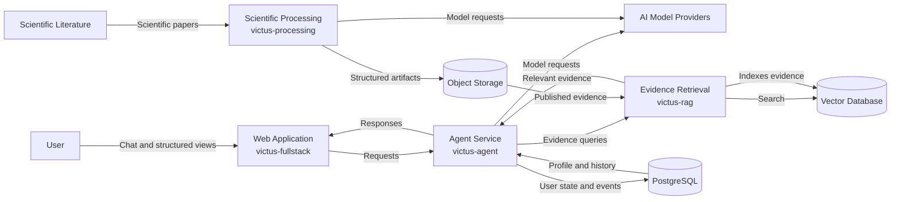

# Containers

This document describes the main applications and data stores that compose Victus.

Implementation progress is documented separately in [Current Status](../overview/current-status).

## Container Diagram

## Web Application

**Repository:** `victus-fullstack`

The user-facing application for Victus.

Its main responsibilities are:

* provide the conversational interface;
* expose structured views for profile, meals, goals, plans, and progress;
* send user actions to the Agent Service;
* present recommendations and relevant evidence.

The chat remains the primary interaction model, while structured views make important user information visible and editable.

## Agent Service

**Repository:** `victus-agent`

The central orchestration layer of the product.

It is responsible for:

* interpreting user requests;
* loading relevant user context;
* applying safety controls;
* coordinating tools;
* requesting scientific evidence;
* managing persistent user events;
* generating the final response.

The Agent Service coordinates other capabilities rather than implementing scientific processing or retrieval itself.

## Evidence Retrieval

**Repository:** `victus-rag`

Provides scientific evidence to the Agent Service.

Its responsibilities include:

* indexing published scientific evidence;
* semantic retrieval;
* ranking and reranking;
* returning evidence with the metadata required for traceability.

Retrieval is kept separate from scientific processing so that evidence generation and evidence consumption can evolve independently.

## Scientific Processing

**Repository:** `victus-processing`

Transforms scientific papers into structured evidence that can later be indexed by the retrieval system.

Its responsibilities include:

* paper ingestion and classification;
* document parsing;
* structured block generation;
* evidence extraction;
* artifact validation;
* publication of final datasets.

Scientific Processing runs independently from the conversational application.

## PostgreSQL

Stores transactional and application state required by Victus.

This includes information such as:

* user events;
* derived projections;
* agent state;
* processing state where applicable.

Detailed schemas belong to the relevant system or contract documentation.

## Object Storage

Stores scientific source material and generated artifacts.

Victus currently uses object storage for:

* original papers;
* intermediate processing artifacts;
* final JSONL and Parquet datasets;
* versioned artifact snapshots.

Backblaze B2 acts as the persistent versioned data lake, with S3-compatible storage also used by the processing infrastructure.

## Vector Database

Stores the indexes used by the evidence retrieval system.

It allows `victus-rag` to retrieve scientific evidence efficiently from the artifacts produced by `victus-processing`.

## External Dependencies

### AI Model Providers

External models provide language understanding, reasoning, extraction, and generation capabilities.

Victus accesses these capabilities through internal abstractions so that the architecture is not tied to a single provider.

### Scientific Literature

Scientific publications are the source material from which Victus builds its evidence base.

They remain external to the Victus platform until they are ingested by the scientific processing system.
