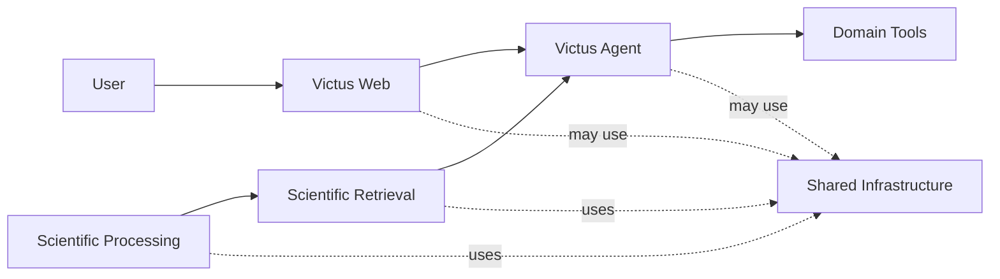

# Victus

Victus is a personalized nutrition and healthy-lifestyle agent designed to turn scientific evidence, user context, and specialized tooling into practical recommendations.

The product is centered on the Victus Agent: the conversational system that coordinates user context, scientific retrieval, domain tools, safety controls, and persistent product state.

Scientific Processing, Retrieval, Fullstack, and Infrastructure exist to support that product goal.

## Product Goal

Victus aims to help users make better nutrition and healthy-lifestyle decisions by combining:

- personal context and history;
- scientific evidence extracted from research papers;
- specialized nutrition and planning tools;
- conversational interaction;
- safety and controlled execution.

The intended result is not a generic health chatbot or scientific search engine.

Victus is intended to provide grounded, personalized, actionable guidance while keeping scientific provenance and user context explicit.

## Core Product Capabilities

### Personalized Guidance

Victus is designed to adapt recommendations to the user's profile, preferences, restrictions, goals, logged behavior, and relevant history.

This is the primary product capability toward which the other subsystems contribute.

### Scientific Evidence

Scientific papers are processed into structured evidence so the Agent can eventually retrieve evidence relevant to a user's request.

The scientific pipeline and retrieval system are separate:

```text
Scientific Papers
      ↓
Scientific Processing
      ↓
Canonical Evidence
      ↓
Scientific Retrieval
      ↓
Victus Agent
```

Scientific Processing produces evidence.

Retrieval finds and ranks it.

The Agent interprets that evidence in the context of the user.

### Specialized Tools

Victus uses controlled tools for actions that should not be handled through unrestricted model output.

Examples include:

- meal capture;
- user-state operations;
- future nutrition analysis;
- planning;
- recommendation support;
- progress and feedback workflows.

The model can propose actions, but persistent changes should pass through explicit runtime boundaries.

### Conversational Interaction

The Agent is the main coordinator of the system.

A conversation may involve:

- direct response generation;
- tool execution;
- clarification;
- confirmation;
- safety blocking;
- persistent domain updates;
- scientific retrieval.

Not every interaction requires every subsystem.

## How Victus Fits Together

At the highest level:



The exact degree of integration differs between subsystems and is documented in [Current Status](./current-status).

## Main Systems

### Victus Agent

The conversational orchestration runtime.

It owns model coordination, safety flow, tool execution, clarification and confirmation, bounded conversational memory, and final response composition.

The current active public tool capability is focused on meal and beverage capture.

[Read Agent documentation](./systems/agent)

### Scientific Processing

The scientific evidence pipeline.

It transforms research papers into structured scientific artifacts suitable for downstream retrieval.

Processing is one of the most mature technical subsystems in Victus.

[Read Scientific Processing documentation](./systems/scientific-processing)

### Scientific Retrieval

The subsystem responsible for indexing, retrieving, ranking, and evaluating scientific evidence.

The current `victus-rag` implementation is primarily a CLI-first retrieval and evaluation laboratory. Product-serving integration is still under development.

[Read Retrieval documentation](./systems/retrieval)

### Victus Fullstack

The user-facing web product.

It currently includes a React frontend, Hono backend, PostgreSQL persistence, authentication, conversation history, meal logging, FoodB catalog access, profile views, biometrics views, and an HTTP gateway to Victus Agent.

[Read Fullstack documentation](./systems/fullstack)

### Shared Infrastructure

The shared runtime platform for Victus.

It defines Docker Compose stacks, VPS deployment, networking, PostgreSQL, Redis, SeaweedFS, LiteLLM, Langfuse, observability foundations, secrets management, and Wiki.js hosting.

[Read Infrastructure documentation](./systems/infrastructure)

## Architecture Documentation

Victus uses a lightweight C4-inspired documentation structure.

### System Context

Explains Victus as a complete system, its users, and its external boundaries.

[System Context](./architecture/system-context)

### Containers

Describes the major Victus subsystems and how they relate.

[Containers](./architecture/containers)

### Data Flow

Explains how information moves between the major systems.

[Data Flow](./architecture/data-flow)

### Systems

Each major subsystem has one focused conceptual page:

- [Agent](./systems/agent)
- [Scientific Processing](./systems/scientific-processing)
- [Retrieval](./systems/retrieval)
- [Fullstack](./systems/fullstack)
- [Infrastructure](./systems/infrastructure)

Implementation-specific details remain in the corresponding repositories.

## Shared Contracts

Contracts belong in the central documentation only when they define a boundary between systems.

Examples include:

```text
Fullstack ↔ Agent
Scientific Processing ↔ Retrieval
Agent ↔ Retrieval
```

Repository-internal schemas, CLI formats, migrations, Qdrant payloads, or implementation-specific structures should remain local to the repository that owns them.

## Current Development Principle

Victus documentation distinguishes between:

```text
Implemented
Partial
Experimental
Planned
```

The presence of code, schemas, UI, or scaffolding does not automatically mean that a capability is active in the product.

The implementation state of each major capability is maintained in [Current Status](./current-state).

## Documentation Ownership

Wiki.js is the central documentation source for:

- product purpose;
- system architecture;
- subsystem responsibilities;
- shared contracts;
- ecosystem-level decisions;
- current implementation state.

Repository documentation should focus on:

- local development;
- setup;
- configuration;
- debugging;
- testing;
- deployment procedures owned by that repository;
- internal implementation contracts;
- repository-local ADRs.

This keeps one authoritative source for each architectural concept.

## Documentation Principles

Victus documentation follows a small set of rules:

- Document the system that exists.
- Clearly mark planned or incomplete behavior.
- Keep architecture separate from implementation details.
- Keep one authoritative source for each concept.
- Prefer a few small diagrams over large architecture maps.
- Keep shared contracts central and internal contracts local.
- Record significant architectural decisions through ADRs.
- Avoid duplicating physical database schemas in the Wiki.
- Treat code and migrations as implementation truth.
- Keep documentation proportional to the size of the project.

## Project Status

Victus already contains most of the major technical foundations required for its intended product.

The primary challenge is now integration.

The most important missing product path is:

```text
User
  ↓
Fullstack
  ↓
Agent
  ↓
User Context + Scientific Retrieval + Nutrition Tools
  ↓
Grounded Personalized Recommendation
```

See [Current Status](./current-state) for the current implementation state and near-term priorities.