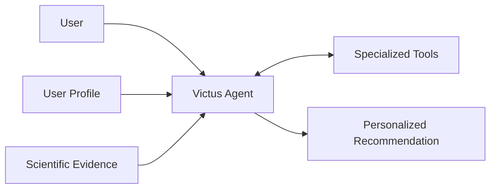

## What is Victus?

Victus is a personalized health and nutrition agent designed to help users improve their diet and healthy living habits.

It combines scientific evidence, user-specific context, and specialized tools to generate recommendations adapted to each user's goals and profile.

The purpose of Victus is not simply to answer health-related questions, but to turn reliable scientific knowledge and personal information into practical recommendations.

## Core Capabilities

Victus is built around four core capabilities:

* **Personalized recommendations** based on the user's profile, goals, preferences, and relevant history.
* **Scientific evidence retrieval** to support recommendations with information extracted from research papers.
* **Specialized tools** for tasks such as dietary analysis, planning, and optimization.
* **Conversational interaction** through an agent capable of coordinating evidence, user context, and tools.

Safety mechanisms complement these capabilities when a request requires additional safeguards.

## How It Works

At a high level, Victus combines three sources of context before producing a recommendation.

The **Victus Agent** acts as the coordinator.

Depending on the request, it can use information from the user's profile, retrieve relevant scientific evidence, invoke specialized tools, or combine these capabilities before generating a response.

Scientific papers are processed separately into structured evidence so they can be retrieved efficiently when the agent needs to support a recommendation.

## System Boundaries

Victus is responsible for:

* understanding health and nutrition requests;
* maintaining relevant user context;
* retrieving scientific evidence;
* using specialized health and diet tools;
* generating personalized recommendations.

Victus is not intended to replace medical professionals or function as a general-purpose scientific search engine.

Its scientific processing, retrieval, memory, safety, and infrastructure systems exist to support the primary product: the personalized health and nutrition agent.

## Current State

Victus is an actively developed personal project.

Some capabilities are already implemented while others remain partial or planned. The documentation describes the system according to its actual implementation state rather than presenting planned functionality as complete.

See [Current Status](./current-status) for the current implementation status of each major capability.

## Documentation

The documentation is organized from the highest-level understanding of Victus to implementation and operational details.

### [Overview](./01-overview/system-overview)

Product purpose, scope, terminology, and current state.

### [Architecture](./02-architecture/system-context)

C4 architecture, system boundaries, containers, deployments, and major data flows.

### [Systems](./03-systems)

Detailed documentation for the Agent, Scientific Processing, Retrieval, Calibration, and Infrastructure subsystems.

### [Data & Contracts](./04-data-and-contracts/overview)

Canonical data models, scientific contracts, artifacts, schemas, and contract governance.

### [Operations](./05-operations/deployment)

Deployment, configuration, observability, recovery, and troubleshooting.

### [Development](./06-development/getting-started)

Repository structure, development environment, testing, and contribution practices.

### [Architecture Decisions](./07-decisions/index)

Architecture Decision Records describing important technical decisions and their rationale.

### [Project Status](./08-project-status/current-state)

Current implementation state, known gaps, technical debt, and roadmap.

## Documentation Principles

Victus documentation follows a few simple rules:

* Document the system that **exists**, not the architecture we hope to build.
* Keep architecture separate from implementation details.
* Maintain one authoritative source for each contract or concept.
* Record important architectural decisions through ADRs.
* Prefer simple diagrams and explicit system boundaries.
* Mark incomplete or planned functionality clearly.
* Keep documentation close to the code and update it as the system evolves.

The architecture documentation follows the **C4 model**, moving from system context to containers and, only where useful, individual components.