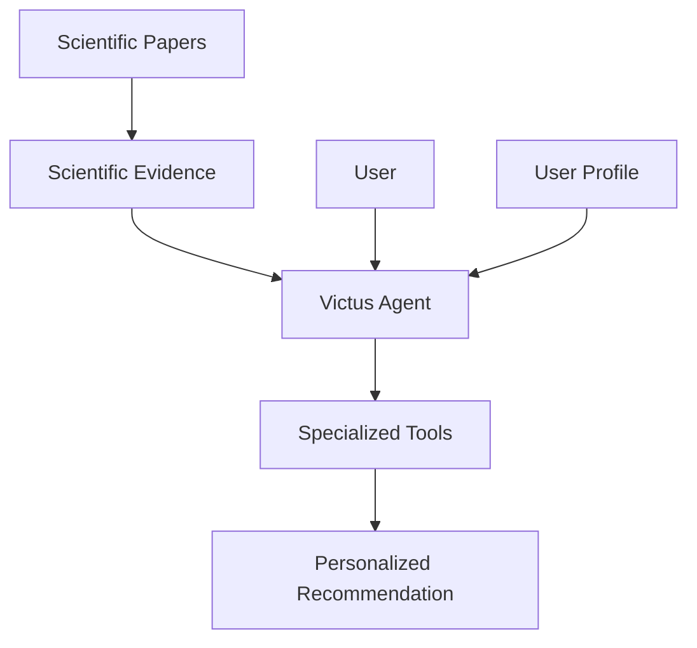

# Victus

Victus is a personalized health and nutrition agent designed to provide practical recommendations for diet and healthy living.

Its recommendations combine three main sources of information:

* **Scientific evidence**, extracted and retrieved from research papers.
* **User profiles**, containing the context required to personalize recommendations.
* **Specialized tools**, used to analyze, plan, and optimize diets and health-related decisions.

The goal of Victus is to bridge the gap between scientific knowledge and actionable, personalized recommendations.

---

## How Victus Works

At a high level, Victus combines a conversational agent with a scientific evidence system and a set of specialized tools.

When a user asks a question or requests a recommendation, Victus can:

1. Understand the user's request and relevant personal context.
2. Retrieve scientific evidence related to the question.
3. Use specialized tools when calculations, planning, or optimization are required.
4. Generate a recommendation adapted to the user's profile.
5. Preserve relevant information to support future interactions.

The scientific evidence system exists to make recommendations traceable to research rather than relying exclusively on the model's internal knowledge.

---

## Core Capabilities

### Personalized Health Agent

The Victus Agent is the primary interface with the user. It coordinates reasoning, user context, scientific evidence, safety checks, and tool execution.

### Scientific Evidence

Victus processes scientific papers into structured evidence that can later be searched and used when answering health and nutrition questions.

### Diet Optimization

Victus can use specialized tools to analyze and optimize dietary decisions according to the user's goals, constraints, and profile.

### User Profiles

User-specific information provides the context required to generate recommendations that are more relevant than generic health advice.

### Safety

Requests and actions can pass through safety mechanisms before recommendations or tools are executed.

---

## System Overview

Victus is composed of several cooperating subsystems.

| System                    | Responsibility                                                   |
| ------------------------- | ---------------------------------------------------------------- |
| **Victus Agent**          | Interacts with the user and orchestrates the system.             |
| **Scientific Processing** | Converts research papers into structured scientific evidence.    |
| **Retrieval**             | Finds relevant evidence for a user's question.                   |
| **Tools**                 | Perform specialized calculations, analysis, and optimization.    |
| **User Profile & Memory** | Maintain relevant context about the user.                        |
| **Safety**                | Detects and routes requests that require additional safeguards.  |
| **Infrastructure**        | Provides storage, databases, execution, and supporting services. |

For the complete architectural view, see [Architecture](../02-architecture/system-context).

---

## Documentation

The documentation is organized from the highest-level understanding of Victus to implementation and operational details.

### [Overview](./01-overview/system-overview)

Product purpose, scope, terminology, and current state.

### [Architecture](./02-architecture/system-context)

C4 architecture, system boundaries, containers, deployments, and major data flows.

### [Systems](./03-systems)

Detailed documentation for the Agent, Scientific Processing, Retrieval, Calibration, and Infrastructure subsystems.

### [Data & Contracts](./04-data-and-contracts/overview)

Canonical data models, scientific contracts, artifacts, schemas, and contract governance.

### [Operations](./05-operations/deployment)

Deployment, configuration, observability, recovery, and troubleshooting.

### [Development](./06-development/getting-started)

Repository structure, development environment, testing, and contribution practices.

### [Architecture Decisions](./07-decisions/index)

Architecture Decision Records describing important technical decisions and their rationale.

### [Project Status](./08-project-status/current-state)

Current implementation state, known gaps, technical debt, and roadmap.

---

## Current State

Victus is under active development.

The documentation distinguishes explicitly between functionality that is:

* **Implemented**
* **Partial**
* **Planned**
* **Deprecated**

See [Current State](./08-project-status/current-state) for the authoritative view of what exists today and what remains to be implemented.

---

## Documentation Principles

Victus documentation follows a few simple rules:

* Document the system that **exists**, not the architecture we hope to build.
* Keep architecture separate from implementation details.
* Maintain one authoritative source for each contract or concept.
* Record important architectural decisions through ADRs.
* Prefer simple diagrams and explicit system boundaries.
* Mark incomplete or planned functionality clearly.
* Keep documentation close to the code and update it as the system evolves.

The architecture documentation follows the **C4 model**, moving from system context to containers and, only where useful, individual components.

